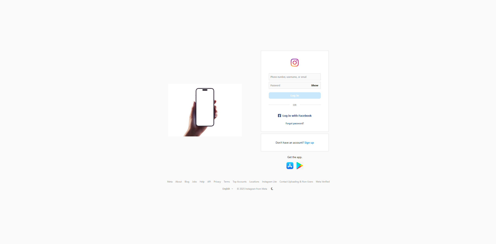
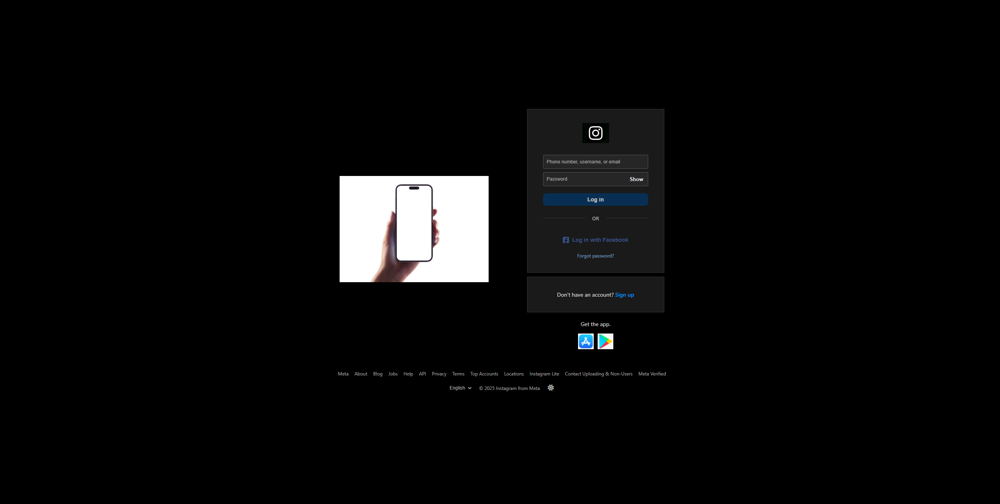

# Instagram Login Page Clone

This project is a responsive clone of the Instagram login page interface, built using HTML, CSS, JavaScript, and a basic PHP structure. It aims to replicate the visual appearance and core client-side functionality, including a dark mode toggle.

**Disclaimer:** This project is intended for educational purposes to practice front-end development skills and responsive design. It does not implement actual user authentication or connect to any Instagram APIs.

## Screenshot

**(Recommended: Add a screenshot of your project here!)**

*Replace the placeholder below with a link to an actual screenshot of your project. You might want to show both light and dark modes.*


*Light Mode*


*Dark Mode*

## Key Features

*   **Visual Replication:** Closely mimics the Instagram login page aesthetic (as of late 2023 / early 2024).
*   **Responsive Design:** Adapts smoothly to various screen sizes (desktop, tablet, mobile).
*   **Dark Mode:** Functional dark mode toggle using CSS variables and JavaScript.
*   **Theme Persistence:** Dark/light mode preference is saved in the browser's `localStorage`.
*   **Basic Form Interaction:**
    *   Input fields for username/email and password.
    *   "Show/Hide" password visibility toggle.
    *   Login button is enabled only when both fields have input (with a basic minimum length check for the password).
*   **Structured Layout:** Includes sections for login, sign-up prompt, app download links, and footer links, similar to the original.
*   **Placeholder Backend:** Includes a minimal `login_process.php` file to demonstrate where form submission would be handled on a server (does not perform real authentication).

## Technologies Used

*   **HTML5:** For the structure and content of the page.
*   **CSS3:** For styling, layout (Flexbox), responsiveness (Media Queries), and theming (CSS Variables).
*   **JavaScript (Vanilla):** For DOM manipulation, handling user interactions (dark mode toggle, password visibility, form validation), and using `localStorage`.
*   **PHP:** Used primarily to structure the main HTML file (`index.php`) and includes a placeholder for server-side form processing (`login_process.php`).
*   **Font Awesome (Optional):** Used for icons (e.g., Facebook logo, theme toggle icons). Can be linked via CDN.

## Setup and Installation

To run this project locally, you'll need a local web server environment that can process PHP.

**Using a Server Stack (like XAMPP, MAMP, WAMP):**

1.  **Prerequisites:** Install XAMPP, MAMP, WAMP, or a similar package providing Apache/Nginx, PHP, and MySQL.
2.  **Clone:** Clone this repository into your local machine:
    ```bash
    git clone https://github.com/MistaaOlivaaa/instagram-login-clone.git
    ```
    (Replace `[your-username]` with your actual GitHub username)
3.  **Move Project:** Copy the entire `instagram-login-clone` folder into your web server's document root directory (e.g., `htdocs` in XAMPP/MAMP, `www` in WAMP).
4.  **Start Server:** Ensure your Apache (or Nginx) server is running via the XAMPP/MAMP/WAMP control panel.
5.  **Access:** Open your web browser and navigate to `http://localhost/instagram-login-clone/` (adjust the URL if your server uses a different port or setup).
6.  **Assets:** Ensure the `assets/` folder contains the necessary images (logos, app badges, phone mockup). You may need to find or create these based on the filenames used in `index.php`.

**Using PHP's Built-in Server (for quick testing):**

1.  **Prerequisites:** Ensure you have PHP installed and accessible in your command line/terminal.
2.  **Clone:** Clone the repository as described above.
3.  **Navigate:** Open your terminal/command prompt and navigate into the project directory:
    ```bash
    cd instagram-login-clone
    ```
4.  **Run Server:** Start the PHP built-in server:
    ```bash
    php -S localhost:8000
    Open your web browser and navigate to `http://localhost:8000`.
    MistaaOlivaaa
    ```
4.1 **XAMPP (Cross-Platform):**
```bash
   XAMPP creates a special folder where your websites must live. This is usually called htdocs and is located inside your XAMPP installation directory (e.g., C:\xampp\htdocs on Windows, /Applications/XAMPP/htdocs on macOS).
   Copy your entire instagram-login folder (including the assets subfolder) into the htdocs folder.
   Open your web browser and go to http://localhost/instagram-login/. The server will find index.php inside that folder and run it.


```


